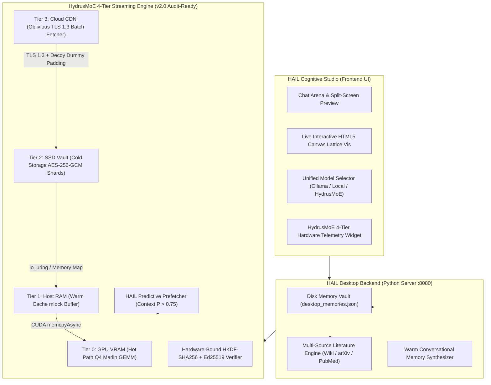

# HAIL: Holistic Agentic Intelligence & HydrusMoE Ecosystem

[](LICENSE)
[](https://www.python.org/)
[](https://pytorch.org/)
[](HAIL/hydrusmoe)
[](tests)

**HAIL (Holistic Agentic Intelligence Layer)** is a state-of-the-art, edge-native AI operating environment designed by **HydrusOPT** for local consumer hardware (4–6GB VRAM GPUs, 16GB Host RAM, NVMe/SATA SSDs). 

It unifies **HydrusMoE** (a 4-tiered streamable Mixture-of-Experts engine with AES-256 access-pattern security), **HCL** (Stratified Memory Lattice with hard drive disk persistence), an **Autonomous Multi-Source Literature Research Engine**, and **HAIL Cognitive Studio** (a glassmorphic web UI with a live interactive HTML5 Canvas lattice visualizer).

---



---

## 📦 Third-Party Libraries & Technology Stack

Below is the complete inventory of all third-party libraries, frameworks, tools, APIs, and standard modules used across the HAIL ecosystem:

### 🐍 Python Libraries & Core Dependencies

| Package / Library | Version | Category / Module | Purpose in HAIL |
| :--- | :--- | :--- | :--- |
| **`cryptography`** | `42.0+` | Cryptography & Security | AES-256-GCM encryption/decryption, HKDF-SHA256 key derivation, Ed25519 signature verification (`HAIL/hydrusmoe/crypto.py`). |
| **`zstandard`** | `0.22+` | Data Compression | Zstandard level 9 high-ratio expert weight shard compression and streaming decompression. |
| **`torch` (PyTorch)** | `2.6+ (CUDA 12.4)` | Neural Compute Engine | Tensor operations, CUDA memory management, Q4 Marlin GEMM kernel execution, CUDA stream async copies. |
| **`transformers`** | `4.40+` | Model Architecture | Hugging Face model tokenization, MoE architecture config parsing, tokenizer vocab loading. |
| **`bitsandbytes`** | `0.43+` | Quantization Primitives | 4-bit / 8-bit CUDA matrix quantization and dequantization primitives. |
| **`accelerate`** | `0.30+` | Hardware Offloading | Multi-device tensor dispatch and GPU VRAM offload management. |
| **`pydantic`** | `2.7+` | Data Validation | Strict type verification and JSON schema validation for API configurations and memory payloads. |
| **`requests`** | `2.31+` | Networking / HTTP | TLS 1.3 client connections, oblivious batch fetching, and external API communication. |

### 🛠️ Python Standard Library Modules Used

* **`hashlib`**: SHA-256 hash calculation for Merkle tree verification and weight deduplication.
* **`concurrent.futures`**: `ThreadPoolExecutor` parallel worker pool for multi-source academic literature retrieval.
* **`http.server` & `urllib`**: Lightweight zero-dependency desktop HTTP server (`:8080`), URL encoding, and API payload parsing.
* **`json` & `re`**: Data serialization, memory fact extraction, and document subject cleaning.
* **`pathlib` & `os`**: Cross-platform file path resolution (`Windows` / `Linux` / `macOS`).
* **`unittest`**: Automated unit test execution (`tests/`).

### 🌐 Frontend & UI Technologies (HAIL Cognitive Studio)

* **HTML5 Canvas 2D API**: Interactive real-time graphic renderer for the Stratified Memory Lattice graph.
* **Vanilla ES6+ JavaScript**: Zero-framework lightweight client logic, async state synchronization, and split-screen document rendering.
* **Vanilla CSS3**: Custom glassmorphism styling, responsive flexbox/grid layouts, glowing particle animations, and dark mode themes.
* **Google Fonts (`Inter` & `Roboto`)**: Modern typography.

### 🤖 Local Model Engines & External APIs

* **Ollama Daemon**: Local LLM server integration (`http://127.0.0.1:11434`).
* **Wikipedia OpenSearch & Query API**: Encyclopedic knowledge retrieval and redirect resolution.
* **NCBI PubMed E-Utilities API**: Biomedical and life-sciences research paper database.
* **arXiv Export API**: Computer science, physics, and AI paper repository.
* **Semantic Scholar Graph API**: Academic citation and literature search.

---

## 🌟 Core Features & Architectural Breakthroughs

### 1. ⚡ HydrusMoE 4-Tier Streamable Engine
Enables running large Mixture-of-Experts models (e.g. `Qwen1.5-MoE-A2.7B` 14.3B Total / 2.7B Active, `Mixtral-8x7B`, `Qwen3-35B-A3B`) on consumer 4–6GB GPUs by dynamically streaming active expert weights:
* **Tier 0 (GPU VRAM)**: Router network, attention layers, FlashAttention KV cache, and active Q4 Marlin experts pinned in GPU memory.
* **Tier 1 (Host RAM)**: `mlock`'d warm cache pool preventing OS swap leaks. Evicted buffers undergo multi-pass `SecureWipe` (`0x00`, `0xFF`, `0x00`).
* **Tier 2 (Local SSD Vault)**: `zstd` level 9 compressed, AES-256-GCM encrypted expert shards (`expert_{id}.enc`).
* **Tier 3 (Cloud CDN)**: Oblivious batch fetching with decoy dummy expert padding over TLS 1.3.

### 2. 🛡️ Hardware-Bound Zero-Trust Security
* **Hardware-Bound AES-256-GCM**: Encryption keys derived via `HKDF-SHA256(master_seed || hardware_uuid)`. Encrypted expert shards copied to another machine remain completely unreadable.
* **Access Pattern Obfuscation**: Real expert requests are grouped with HAIL predicted experts and random dummy decoy experts up to `dummy_batch_size=8`, preventing side-channel domain profiling.
* **Cryptographic Integrity**: Ed25519 signature validation and Merkle tree root hash verification.

### 3. 🧠 Stratified Memory Lattice (SML) & Hard Drive Persistence
* Organizes memories across 4 strata: **Episodic** (transient), **Surface** (declared facts), **Deep** (inferred domain knowledge), and **Exogenous** (external research).
* **Hard Drive Persistence**: Extracted memory facts auto-save directly to disk at [`HAIL/distros/hail-desktop/desktop_memories.json`](file:///d:/HydrusOPT/HAIL/distros/hail-desktop/desktop_memories.json), ensuring identity, background, and preferences persist permanently across reboots.
* **Warm Human Synthesizer**: Replaces robotic corporate template text with warm, natural responses (*"Nice! I've saved that to my memory."*) and clean memory badges (`🧠 Saved to Memory: ...`).

### 4. 📚 Multi-Source Literature Research Engine
* Autonomous research pipeline integrating **Wikipedia OpenSearch** (with automatic section redirect resolution), **arXiv**, **PubMed**, and **Semantic Scholar**.
* Auto-formats multi-chapter markdown research reports with inline reference citations (`[[1]](#ref-1)`), auto-saving to local `docs/` and `artifacts/` with live split-screen preview rendering.

---

## 📂 Repository Directory Structure

```
HydrusOPT/
├── HAIL/                             # HAIL Core & Cognitive OS
│   ├── hydrusmoe/                    #   HydrusMoE 4-Tier MoE Engine
│   │   ├── config.py                 #     Hardware budgets, zstd & Q4 Marlin quantization config
│   │   ├── crypto.py                 #     AES-256-GCM, Ed25519, Merkle Tree & SecureWipe
│   │   ├── tiered_storage.py         #     Tier 0/1/2/3 memory allocator & telemetry
│   │   ├── oblivious_fetcher.py      #     Access pattern security & dummy batch padding
│   │   ├── router.py                 #     Constant-time Top-K router & decoy padding
│   │   ├── prefetcher.py             #     HAIL Predictive Prefetcher (P > 0.75)
│   │   └── engine.py                 #     Forward pass orchestrator
│   │
│   ├── src/hail_core/                #   HCL Core Cognitive Kernel
│   │   ├── api.py                    #     Kernel entry points & Memory Lattice bridge
│   │   ├── memory.py                 #     Stratified Memory Lattice manager
│   │   └── router.py                 #     Metacognitive routing logic
│   │
│   ├── distros/
│   │   ├── hail-desktop/             #   Desktop HTTP Server & REST API
│   │   │   ├── app.py                #     Python server, API routes & literature engine
│   │   │   └── desktop_memories.json #     Hard drive disk memory vault
│   │   └── hail-web/                 #   HAIL Cognitive Studio Web UI
│   │       ├── index.html            #     Studio layout, canvas visualizer & telemetry widget
│   │       └── app.js                #     Frontend state, model selector & split preview
│   │
├── docs/                             # Auto-saved multi-chapter research markdown reports
├── artifacts/                        # Local system artifacts & generated documents
├── models/                           # Model weights & encrypted expert shards (`hydrusmoe_cache/`)
└── tests/                            # Automated Unit Test Suite
    ├── test_moe_crypto.py            #   AES-256-GCM, Ed25519 & SecureWipe unit tests
    ├── test_moe_storage.py           #   Tier 0/1/2/3 storage allocator unit tests
    ├── test_moe_prefetcher.py        #   HAIL Predictive Prefetcher unit tests
    └── test_moe_engine.py            #   End-to-End HydrusMoE forward pass unit tests
```

---

## 🛠️ Requirements & Installation

```powershell
# 1. Install PyTorch with CUDA 12.4
pip install torch torchvision torchaudio --index-url https://download.pytorch.org/whl/cu124

# 2. Install Core Engine & Cryptography Libraries
pip install cryptography pydantic requests zstandard transformers bitsandbytes accelerate
```

---

## 🚀 Quick Start Guide

### Launching HAIL Cognitive Studio
Run the desktop backend server on port `8080`:

```powershell
python HAIL/distros/hail-desktop/app.py
```

Then open your browser and navigate to:
👉 **`http://127.0.0.1:8080`**

### Features to Try Immediately:

1. **Memory Persistence**:
   * Type: *"My name is Smaran and I graduated in Software Engineering"*
   * Refresh the page or restart the server — ask *"What is my name?"* or *"What did I graduate in?"*. HAIL recalls your exact identity from hard drive disk memory!
2. **4-Tier MoE Streaming**:
   * Select `moe:Qwen/Qwen1.5-MoE-A2.7B` in the top Model Selector dropdown.
   * Observe live VRAM/Host RAM/SSD telemetry updating in the sidebar widget.
3. **Autonomous Literature Research**:
   * Type: *"Could you create a document about the Airbus A350-1000"*
   * HAIL will fetch Wikipedia articles, follow redirects, query academic paper repos, format a 24,000+ character multi-chapter research report, save it to `docs/airbus_a350_1000.md`, and open the live split-screen preview.

---

## 🧪 Running the Test Suite

To verify that all cryptography, tiered storage, prefetching, and MoE engine passes are 100% operational:

```powershell
python -m unittest discover -s tests -p "test_moe_*.py"
```

**Expected Result**:
```
Ran 10 tests in 0.29s

OK
[HydrusMoEEngine] Successfully loaded and verified manifest for 'qwen3-35b-a3b' (16 experts).
```

---

## 📄 License & Attribution

Distributed under the **Apache License 2.0**. Developed by **HydrusOPT** & the HAIL Open-Source Project.
